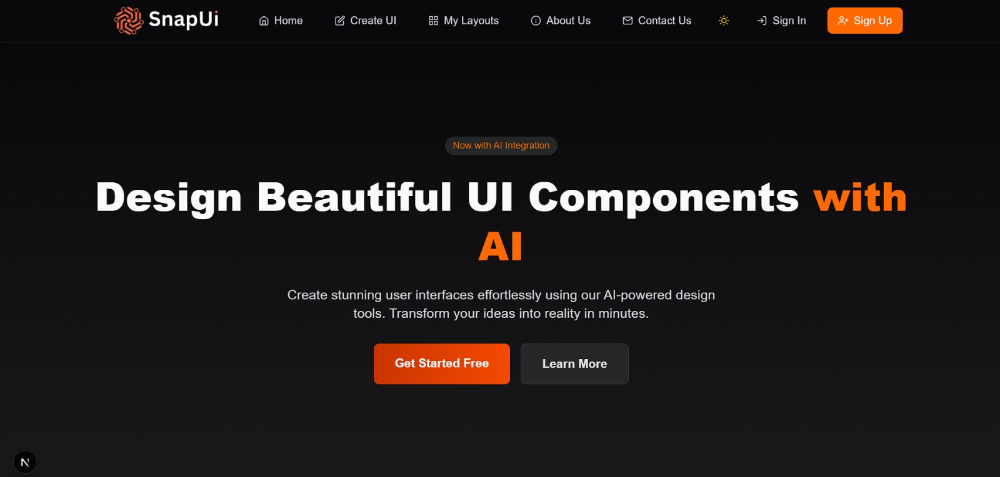

# SnapUI - AI-Powered UI Design Platform

A powerful web application that allows users to design beautiful UI components with AI assistance. Built with React, TypeScript, and Next.js.

## 📸 Screenshots

Here are some screenshots of the application:

### Home Page


## 🚀 Features

- **Drag-and-Drop Interface**: Easily create UI layouts by dragging and dropping components
- **Mail Notifications**: Mail Updates sent through mail notification Service Nodemailer to users
- **Multiple UI Libraries**: Support for Shadcn UI, Material UI, and Ant Design components
- **Component Styling**: Customize components with an intuitive styling interface
- **Layout Management**: Save, load, and manage your UI designs 
- **Export Options**: Export your designs as HTML, or React code
- **Responsive Design**: Create layouts that work across different screen sizes
- **User Authentication**: Secure user accounts with authentication
- **Dark Mode Support**: Switch between light and dark themes

## 📋 Prerequisites

- Node.js 18.x or higher
- npm or yarn package manager

## 🛠️ Installation

1. Clone the repository:
   ```bash
   git clone https://github.com/yourusername/ui-designer-website-with-ai-integration.git
   cd ui-designer-website-with-ai-integration
   ```

2. Install dependencies:
   ```bash
   npm install
   # or
   yarn install
   ```

3. Create a `.env.local` file in the root directory with the following variables:
   ```
   MONGODB_URI=your_mongodb_connection_string
   JWT_SECRET=your_jwt_secret
   NEXT_PUBLIC_API_URL=http://localhost:3000/api
   ```

4. Start the development server:
   ```bash
   npm run dev
   # or
   yarn dev
   ```

5. Open [http://localhost:3000](http://localhost:3000) in your browser to see the application.

## 🏗️ Project Structure

```
/
├── app/                  # Next.js app directory
│   ├── api/              # API routes
│   ├── createui/         # SnapUI designer page
│   ├── signin/           # Authentication pages
│   ├── signup/           
│   └── ...
├── components/           # React components
│   ├── ui/               # UI components
│   ├── ui-libraries/     # UI library components
│   └── ...
├── lib/                  # Utility functions and helpers
├── public/               # Static assets
└── ...
```

## 🔧 Technologies Used

- **Frontend**:
  - Next.js 15.x
  - React 19.x
  - TypeScript
  - Tailwind CSS
  - Shadcn UI
  - Material UI
  - Ant Design

- **Backend**:
  - Next.js API Routes
  - MongoDB with Mongoose
  - JWT Authentication

- **Tools & Libraries**:
  - React DnD (for drag and drop functionality)

## 🤝 Contributing

Contributions are welcome! Please feel free to submit a Pull Request.

1. Fork the repository
2. Create your feature branch (`git checkout -b feature/amazing-feature`)
3. Commit your changes (`git commit -m 'Add some amazing feature'`)
4. Push to the branch (`git push origin feature/amazing-feature`)
5. Open a Pull Request

## 📄 License

This project is licensed under the GPL 3.0 License - see the LICENSE file for details.

## 👥 Authors

*Sameer Sambhare, Pranit Sarode, Krushna Salbande, Sanket Shende*

## 🙏 Acknowledgments

- Shadcn UI for the beautiful component library
- Next.js team for the amazing framework
- All contributors who have helped shape this project
